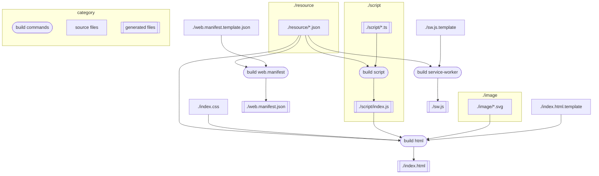

# How to build

## Prerequisites

- Node.js (version 16 or higher recommended)
- npm (Node Package Manager)

## Steps

1. Install dependencies:
   ```sh
   npm install
   ```
2. Build the project:
   ```sh
   npm run-script "build all"
   ```

# Build Workflow Diagram


( You can see this diagram in VS code with [Markdown Preview Mermaid Support extension](https://marketplace.visualstudio.com/items?itemName=bierner.markdown-mermaid). )

# Build Commands

- `npm run-script "build all"` — Runs all build processes.
- `npm run-script "build web.manifest"`
- `npm run-script "build service-worker"`
- `npm run-script "build script"`
- `npm run-script "build html"`
